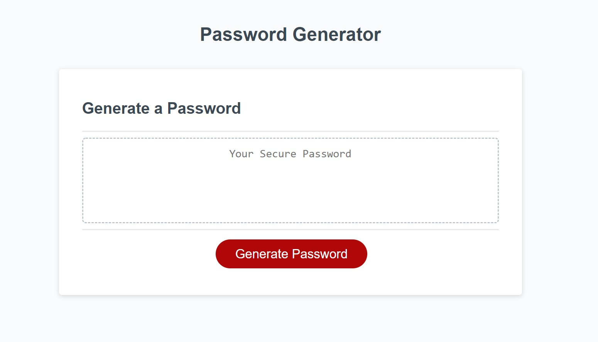

# password-generator

## Description
I was tasked with this project to create an application that generates a random password based on user-selected criteria. The app runs in the browser and features dynamically updated HTML and CSS powered by JavaScript code. It has a clean and polished user interface and is responsive, which ensures that it adapts to multiple screen sizes.

## Table of Contents
[Installation](#installation)
[Screenshot](#screenshot)
[Credit](#credit)
[License](#license)

## Installation
You can view files using Visual Studio Code on your terminal or computer.
VS Code was used to make edits to the HTML and CSS files.
GitBash was used to push the files to the repository.
GitHub is where the updated files are published.
Installation on https://danpoggetti.github.io/my-portfolio/

## Screenshot

## Credit
In order for completing the task, I used many resources. To give credit where credit is due, those sourcess are: Google, OWASP Foundation, Dev.to, sourcecodester.com and W3.

## License
MIT License

Copyright (c) 2022 Dan Poggetti

Permission is hereby granted, free of charge, to any person obtaining a copy
of this software and associated documentation files (the "Software"), to deal
in the Software without restriction, including without limitation the rights
to use, copy, modify, merge, publish, distribute, sublicense, and/or sell
copies of the Software, and to permit persons to whom the Software is
furnished to do so, subject to the following conditions:

The above copyright notice and this permission notice shall be included in all
copies or substantial portions of the Software.

THE SOFTWARE IS PROVIDED "AS IS", WITHOUT WARRANTY OF ANY KIND, EXPRESS OR
IMPLIED, INCLUDING BUT NOT LIMITED TO THE WARRANTIES OF MERCHANTABILITY,
FITNESS FOR A PARTICULAR PURPOSE AND NONINFRINGEMENT. IN NO EVENT SHALL THE
AUTHORS OR COPYRIGHT HOLDERS BE LIABLE FOR ANY CLAIM, DAMAGES OR OTHER
LIABILITY, WHETHER IN AN ACTION OF CONTRACT, TORT OR OTHERWISE, ARISING FROM,
OUT OF OR IN CONNECTION WITH THE SOFTWARE OR THE USE OR OTHER DEALINGS IN THE
SOFTWARE.
